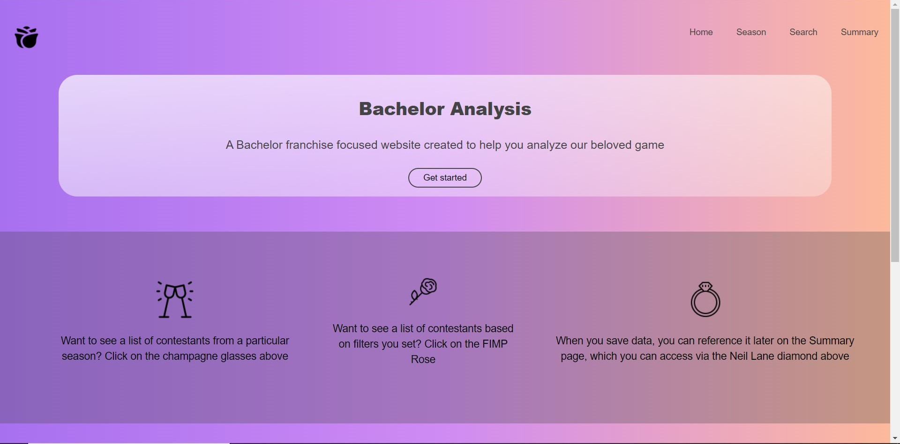
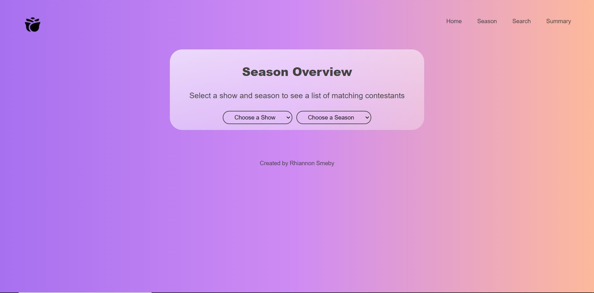
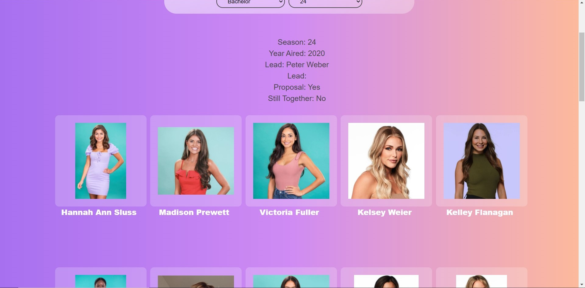
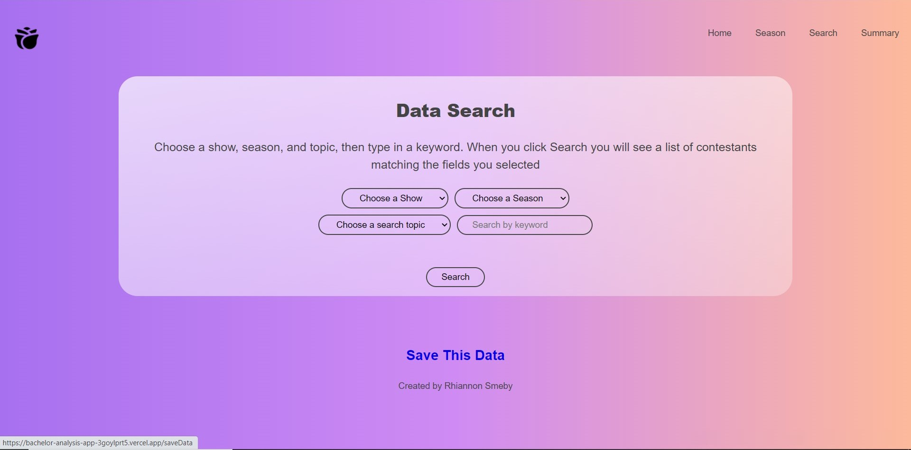
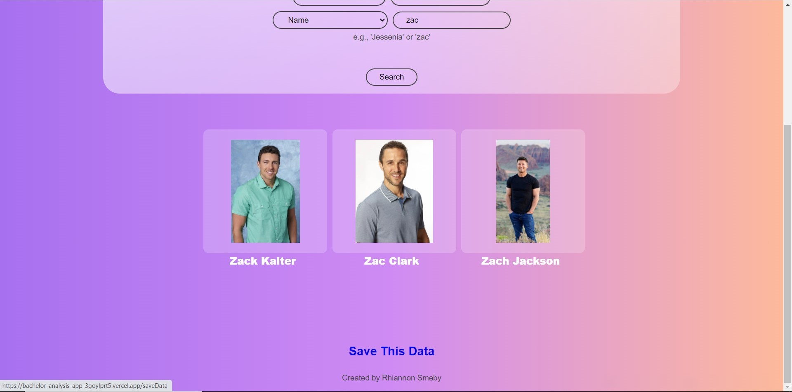
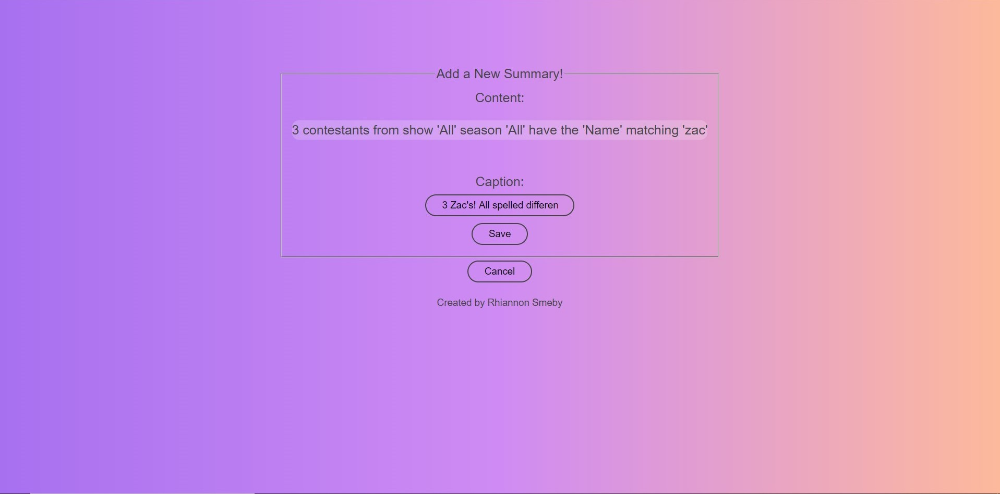
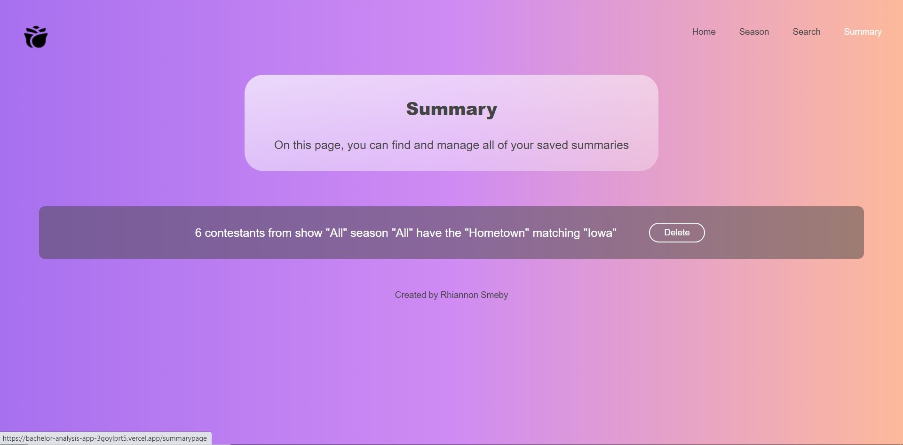
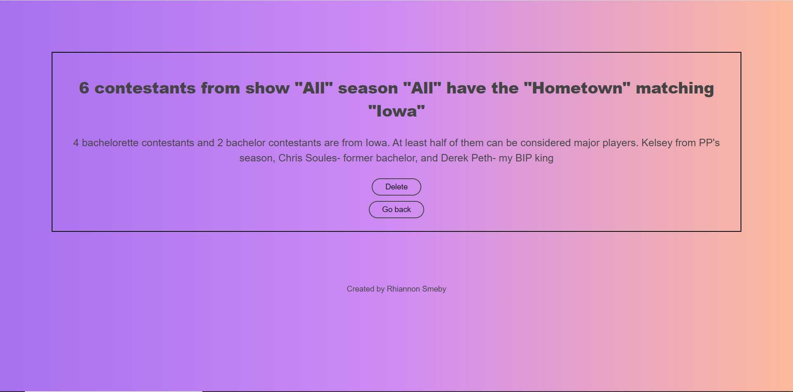

# Bachelor Analysis

https://bachelor-analysis-app.vercel.app/

### Screenshots

### Summary

Bachelor Analysis allows users to access basic data on all contestants throughout the The Bachelor & The Bachelorette's 20-year history on one easy-to-use website. Users may look at data displayed by season or filtered by season and keyword, and they are able to save data they find interesting to the Summary page along with a comment/ explanation of the conclusions they've drawn from the results.

Bachelor Analysis API: https://github.com/rhiannonsmeby/bachelor-analysis-server

### Technology used

React initialized with the create-react-app node package

### Contact information

For any questions, suggestions, or job opportunities, please contact me at smebyrhi@gmail.com
